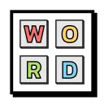
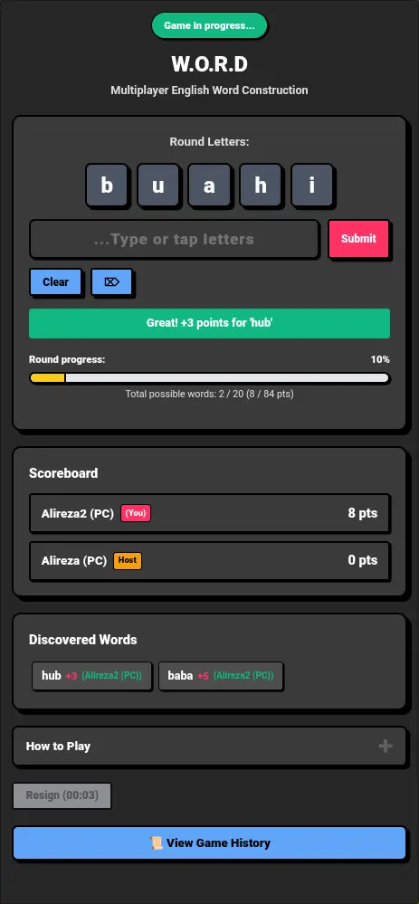

<p align="center">
  
</p>
<h1 align="center">W.O.R.D (Anagrams)</h1>

**W.O.R.D** is a [webxdc](https://webxdc.org) app that runs inside **Delta Chat**, bringing a multiplayer word-building game to your chats:

- 🔤 **5 letters per round** — One vowel plus four random letters, identical for every player  
- 🏗️ **Build words together** — Form valid 3+ letter words from the round's letters; reusing letters is allowed  
- 🏆 **Score by word length** — Longer words earn more points, and the first player to reach 50% of the total possible points wins  
- 👥 **Real-time multiplayer** — The host starts a round, a waiting lobby counts down until a second player joins, and every word submission syncs to the whole chat  
- 🏁 **Multiple end conditions** — All words found, a player hits half the points, everyone else resigns, or 3 minutes pass without a new word  
- 📜 **Game history** — Finished rounds are saved locally so you can review past games  
- 🌐 **Multi-language support** — All UI text is managed through i18n files

## Screenshot



## Development

The app is plain HTML/CSS/JS with no build step. Open `index.html` directly in a browser to develop — `webxdc.js` provides a stub of the webxdc API with simulated players you can switch between, so multiplayer works outside Delta Chat.

To test real chat integration, you have two options:
1. Run /git-assets/make-xdc.sh and it will create /temp/app.xdc
2. Package the main folder (without `locals`) and ‍`locals/XX/` files as a `.zip` file, rename it to `.xdc` and and send it into any supported messenger(like DeltaChat).

The word dictionary is gzip-compressed into `dictionary.packed.js`. Rebuild it from a plain-text word list (one word per line) with:

```
node build-dict.js words.txt
```

### Adding a language

Copy an existing locale folder under `locals/` (e.g. `locals/en/`), translate the strings in `strings.js`, and update `manifest.toml`. Each locale needs its own `icon.png` and a `dictionary.packed.js` built from a word list in that language(described above).
